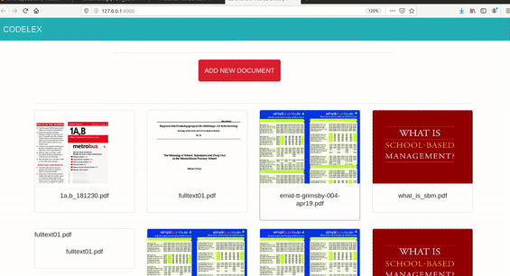

# PDF document upload



> Single page app with Thumbnails of the first page of PDF document.

> When clicking on thumbnail, full document is shown in full screen modal. 

> All communication from the front to backend - through REST API.

> Codebase PHP 7.2.

> For backend/front used Laravel and Vue.

> Database MySQL.

## Installation

### Clone

- Clone this repo to your local machine using `https://github.com/shternberga/PDF_document_upload_REST.git`

### Setup

> install this package first

```shell
$ composer install
```

> now install npm

```shell
$ npm install
```

> add Your database connection variables into your .env file

```shell
DB_CONNECTION=mysql
DB_HOST=127.0.0.1
DB_PORT=3306
DB_DATABASE=YourDatabeseName
DB_USERNAME=YourUsername
DB_PASSWORD=YourPassword
```
---

Be sure, you have Imagick driver installed on your system
- I used this <a href="https://tecadmin.net/install-imagemagick-on-linux/" target="_blank">instructions</a> for installing Imagemagick on Linux.


## Authors

* **Lilija Sternberga** - [GitHub](https://github.com/shternberga), 
                          [LinkedIn](https://www.linkedin.com/in/lilija-sternberga/)

